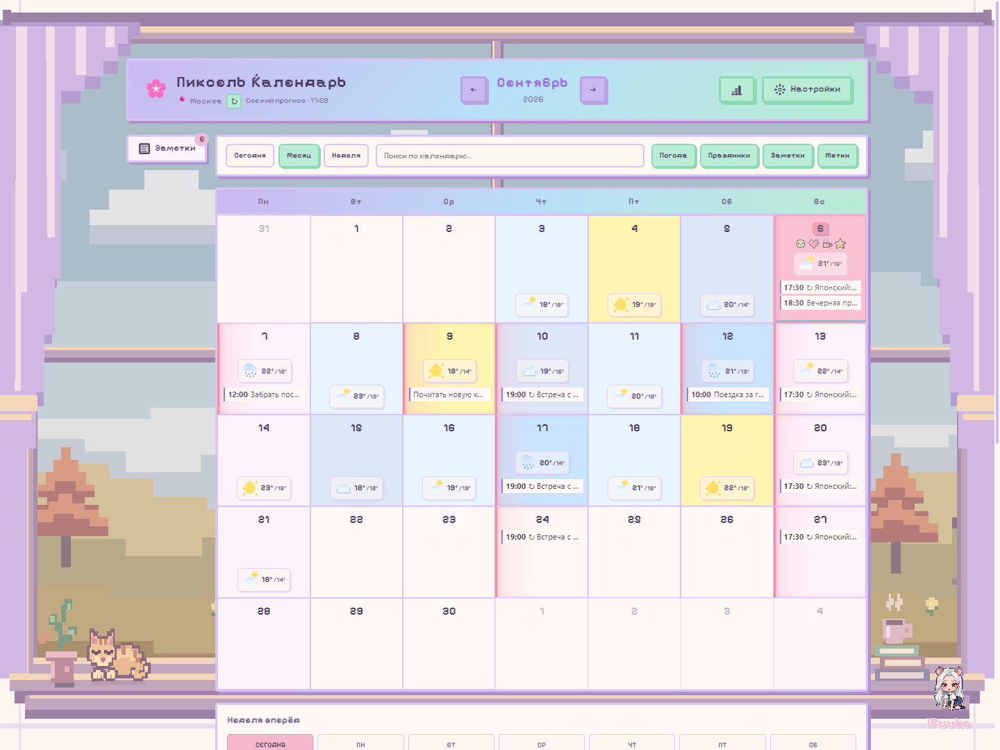
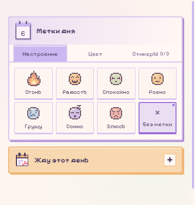
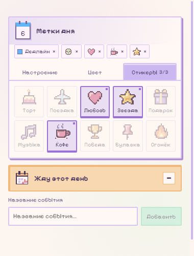
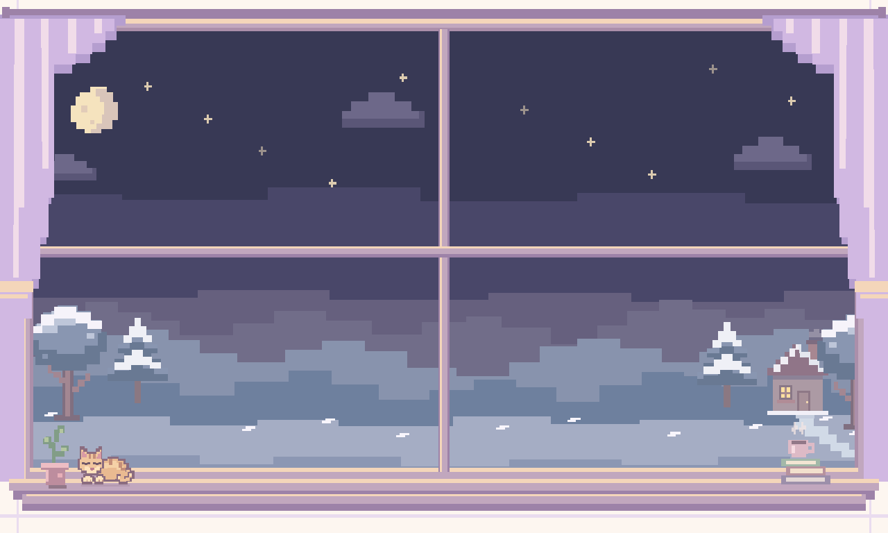

<div align="center">


# Pixel Calendar

**Уютный пиксельный календарь с живым окном, погодой и планами на день.**

*A cozy pixel-art calendar with a living window, weather and daily plans.*

**[Скачать 3.6.1 для Windows](https://github.com/iFuuka/pixel-calendar/releases/download/v3.6.1/PixelCalendar-Portable-3.6.1.exe)** · **[Все релизы / Releases](https://github.com/iFuuka/pixel-calendar/releases)**

Windows x64 · Portable · Русский / English · 5 тем

</div>



*Актуальный интерфейс версии 3.6.1. Все записи и погодные данные на скриншотах — демонстрационные.*

## Что умеет

| | Возможности |
| --- | --- |
| **Живой фон** | Пейзаж за окном меняется по погоде, сезону и времени суток. Дождь, снег, листва, бабочки, светлячки и прорисовывающиеся пиксельные молнии. |
| **Оформление дня** | Настроение, подписанные цветные метки и до трёх пиксельных стикеров. Выбранные значки видны под датой в календаре. |
| **События и заметки** | Месячный и недельный виды, время события, повторы, поиск и теги. Перетаскивание переносит отдельное вхождение серии. |
| **Погода для планов** | Прогноз Open-Meteo, почасовой график и погода для события с отметкой «На улице». Возможные варианты времени выбираются вручную. |
| **Напоминания и отсчёты** | Уведомления с переходом к событию и откладыванием на 15 минут. Кнопка «Жду этот день» добавляет обратный отсчёт. |
| **Привычки и данные** | Привычки с отметками, полная резервная копия и проверка файла перед восстановлением. Данные хранятся локально. |

<table>
<tr>
<td width="50%" valign="top">
<strong>Настроение дня</strong><br />

</td>
<td width="50%" valign="top">
<strong>Стикеры и обратный отсчёт</strong><br />

</td>
</tr>
</table>

## Живое пиксельное окно

Кот дышит во сне и иногда шевелит хвостом, над кружкой поднимается пар. Рама и шторы неподвижны. Фон и анимации отключаются в настройках; поддерживается системное уменьшение движения.

<details>
<summary>Посмотреть зимнюю ночную сцену</summary>



</details>

Для демонстрации нажмите **10 раз на текст iFuuka** в правом нижнем углу, без пауз дольше трёх секунд. Во вкладке **«Фон»** доступны восемь готовых сцен, ручной выбор погоды и сезона, автопоказ и просмотр пейзажа без календаря. Демо не меняет записи и реальный прогноз.

## Как пользоваться

1. Скачайте `PixelCalendar-Portable-3.6.1.exe` из [релиза](https://github.com/iFuuka/pixel-calendar/releases/tag/v3.6.1) и запустите. Установка не нужна.
2. Откройте нужный день, добавьте запись и при необходимости укажите время, повторение и напоминание.
3. Выберите настроение, цвет или стикеры. Для обратного отсчёта нажмите **«Жду этот день»**.
4. Для переноса данных используйте **Настройки → Данные → Полная резервная копия**. Восстановление покажет содержимое файла перед подтверждением.

**Крестик скрывает календарь в трей.** Для полного выхода выберите **Quit App** в меню значка. Напоминания работают, пока приложение запущено, в том числе в трее. Время событий соответствует часовому поясу устройства.

Portable означает отсутствие установки; данные не лежат рядом с exe. Для переноса на другой компьютер используйте резервную копию. Погодные предложения оценивают температуру и осадки в час начала, без учёта длительности события и дороги.

<details>
<summary>English quick start</summary>

Download the [Windows x64 portable app](https://github.com/iFuuka/pixel-calendar/releases/latest), then open a day to add notes, timed or recurring events, reminders and pixel decorations.

The background follows weather, season and daylight. Five themes and Russian/English are available. The countdown button, habits and full backups are included.

Closing the window keeps the app in the system tray; choose **Quit App** to exit. Reminders require the app to be running. Event times use the device time zone. Data is stored locally; use a full backup to move it to another computer.

For scenery previews, click the **iFuuka text** ten times, then open the scenery tab.

</details>

## Разработка / Development

```sh
npm ci
npm run dev
```

- `npm run electron:dev` — приложение Electron в режиме разработки.
- `npm test` — автоматические проверки.
- `npm run lint` — проверка кода.
- `npm run electron:build` — сборка Windows x64 portable в `release/`.

`node scripts/preview-ui.mjs` создаёт визуальные примеры на демонстрационных данных для всех тем. При запущенном `npm run dev` откройте `/dist/review/vanilla-sky.html`. Production-сборка удаляет эти примеры из `dist`.

## История версий

[Изменения 3.6.1](release_notes.md) · [Все выпуски и файлы](https://github.com/iFuuka/pixel-calendar/releases)

---
**Created by iFuuka**
